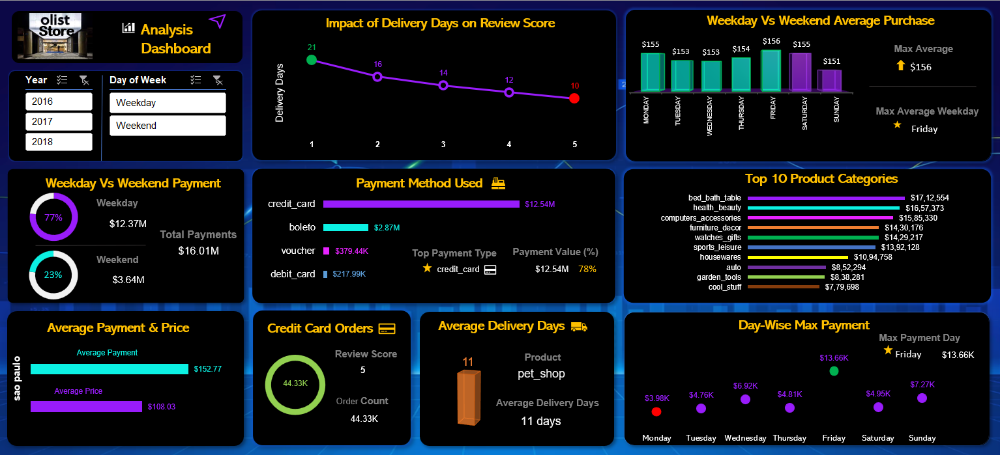
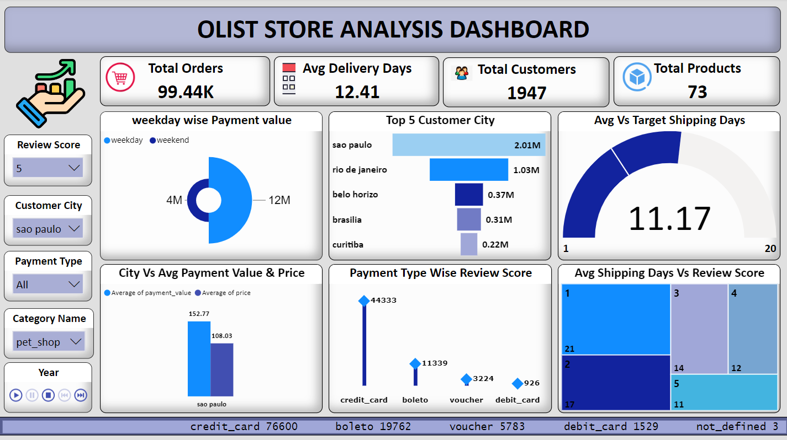
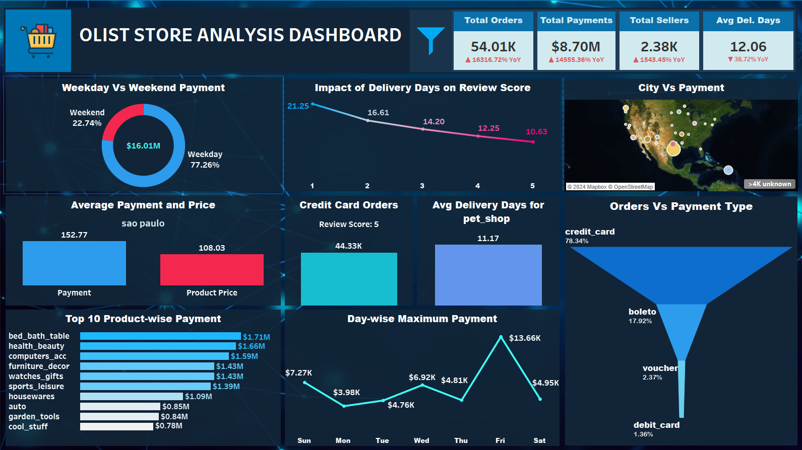

# E-Commerce Project - Olist Store Analysis

We were given 9 dataset files in CSV format and were required to provide insights regarding the customer behavior to the Olist Store.

Based on the visualizations and dashboards created in Excel, Tableau and PowerBI, we needed to provide our key findings regarding the Key Performance Indicators (KPIs) provided and suggest recommendations.

## Mentors

- Kunal Kumar Nath
- Pallavi Bapuram
## Team

- Clive Dominic Andrews
- Rekha Guravvagol
- Shailgiri Jaiswal
- Akhila
- Vali Shaikh
- Vamshi Krishna
- Sandra

## Data Set

- Domain : E-Commerce
- Project Name: Olist Store Analysis
- Dataset Name: Total 9 files
- Dataset Type: CSV Data
- Dataset Zip Folder Size: 45 MB

## KPIs
    1. Weekday Vs Weekend (order_purchase_timestamp) Payment Statistics
    2. Number of Orders with review score 5 and payment type as credit card.
    3. Average number of days taken for order_delivered_customer_date for pet_shop
    4. Average price and payment values from customers of sao paulo city
    5. Relationship between shipping days (order_delivered_customer_date order_purchase_timestamp) Vs review scores.

## Observations/Findings

#### KPI 1:
    We have noticed that the payments are higher on weekdays when compared to Weekend

#### KPI 2:
    - The number of orders with review score 5 and payment type as credit card are 44.33K.
    - We have observed that Boleto is the second most popular method of payment where it is a prepaid payment method which is used for online payment.
    - We also see that the number of installments are increasing the percentage of payment
    - values are reducing suggesting that most people prefer to pay either upfront or with lesser installment duration rather than higher.
    - We see that 10 month installments are high, which could be due to some offer that was in place.

#### KPI 3:
    The average number of days taken for order delivered customer date for pet_shop is 11 days

#### KPI 4:
    The average price and payment values from customers of sao paulo city are $152.77 and $108.33 respectively.

#### KPI 5:
    - There is an inverse relationship between the shipping days and the review scores i.e., Customers are satisfied when the delivery time is reduced.
    - The highest average review score of 5 was seen when the delivery days is the least ~10 days and so on.
    - The lowest average review score of 1 was seen when the delivery days was 21.

## Suggestions

#### KPI 1:
    1. We have noticed that the payments are higher on weekdays when compared to Weekend, where there is a lot of scope but not exploited. People are free on weekends and can be lured to visit the physical stores on weekends by having more promotional offers (sales, discount vouchers, etc) on the weekend, when more customers are free to avail the offers and employ more staff to handle the crowd.
    2. When checking the payment type we see that the vouchers have less volume and there is scope to expoit this option.

#### KPI 2:
    1. Limit the installment duration to avail maximum sale. We can have similar offer suggested for 3 months duration so that more number of people will avail this offer
    2. This will ensure that customers wanting to purchase products are being compelled to purchase but not withstanding due to lack of funds, not made easier by the installment options.
    3. Also, giving offers such as interest free installments and/or no processing fees to ensure that purchase is completed.
    4. Keep special offers for using Boleto in physical stores on weekends and online stores on weekdays, when they are busy working and cannot go physically to the store.

#### KPI 3:
    1. Target to reduce the shipping days
        - Segregate the top moving products
        - Prioritize the products according to the customer history

#### KPI 4:
    1. Sao Paulo city customers buy low price products
    2. To achieve highest sale
        - Top products stocked adequately
        - Offer as buy1-get1 for more sale
        - Reviews from the seller                    

#### KPI 5:
    1. The average delivery time of 11-12 is very high and should be aimed to be reduced to 1 week or lower.
    2. Keep customers happy (Customer loyalty program)
       - Providing membership (Ex: Gold)
       - Providing free shipment charges above a particular cart size or on specific days (Ex. Weekends)
       - Providing Vouchers based on sale amount
       - Discounts after reaching target
       - Gift products based on the frequent sales made
    3. Coordinating with the sellers to identify customer behaviour and stocking products most purchased and getting feedback on slow moving products, etc.
        - Clubbing slow moving product with fast moving product as offers to increase sale of slow moving products.
    4. Promting customers purchasing a specific product frequently of offers on that product to increase customer loyalty and benefit to both customer and the store.
    5. Ensuring that feedback of customers are taken at stores and review obtained in person to help better service and obtain that better review score

## Screenshots

## Excel Dashboard:

## PowerBI Dashboard:

## Tableau Dashboard:

