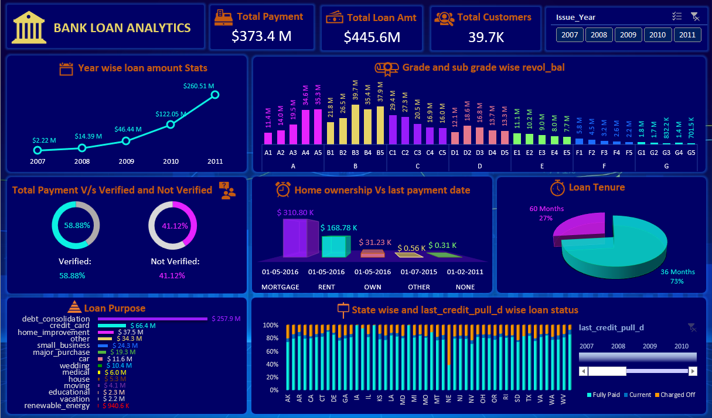
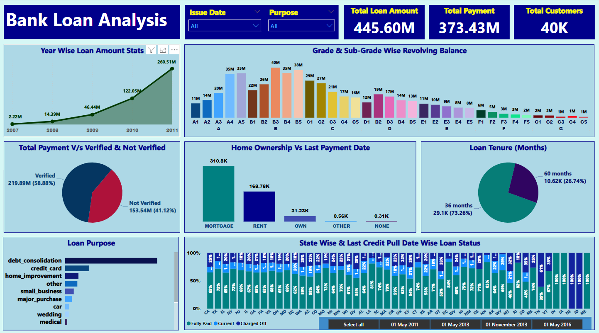
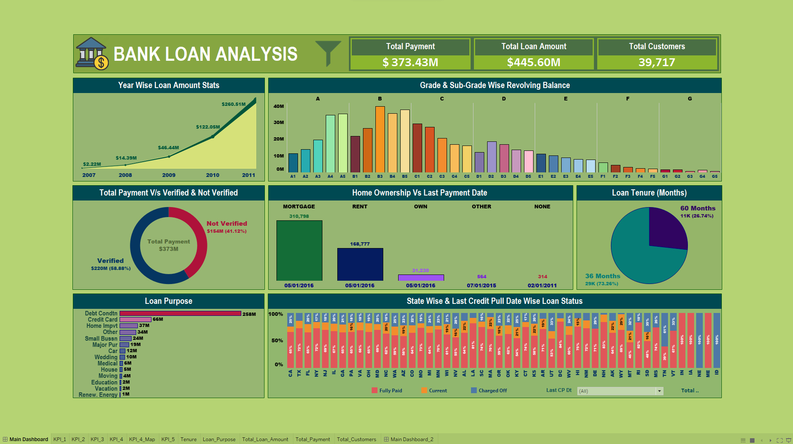

# Banking Project - Bank Loan Analytics

The Objective of this project was to gain insights into the bank's lending operations using finance data.

Based on the visualizations and dashboards created in Excel, Tableau and PowerBI, we needed to provide our key findings regarding the Key Performance Indicators (KPIs) and provide insights and suggest recommendations.

## Mentors

- Dipti Sinha
- Vithal H Byahatti

## Team

- Clive Dominic Andrews
- Chandan Gope
- Bhagyashri Hanmanth Dhembare
- Mangesh Narendra Katkar
- Shruti Min
- Harshit C
- Shubham Rajesh Kumar Singh

## Data Set

- Domain : Banking
- Project Name: Bank Loan Analytics
- Dataset Name: Total 2 files i.e., Finance_1.csv and Finance_2.xlsx
- Dataset Type: .csv and .xlsx datasets
- Dataset Zip Folder Size: 24 MB

## KPIs
1. Year-Wise loan amount statistics.
2. Grade and sub-grade wise revolving balance.
3. Total Payment for verified status Vs non-verified status
4. State wise and last_credit_pull_d (last credit pull date) vise loan status
5. Home ownership Vs last payment date stats

## Observations/Findings

#### KPI 1: Year-Wise loan amount statistics.
- Loan amount steadily increases over the years, showing growth in lending activities.
- The loan amout increased by approximately 455% from 2007 to 2011.
- The highest loan amount was in 2011, reached 260.51 million dollars, indicating a surge in demand for loans.
- 2010 also saw substantial lending with 122.05 million dollars disbursed, reflecting a robust lending period.
- The loan amounts were relatively lower in 2007 and 2008, possibly due to the financial crisis.
- Overall the total loan amout disbursed during the analyzed period is 445.60 million dollars, showing the bank's significant contribution to the lending market.

#### KPI 2: Grade and sub-grade wise revolving balance.
- Highest revolving balance in Grade B is 197.31 million dollars, followed by Grade A with 115.77 million dollars.
- Sub-grade B3 has the highest revolving balance indicating higher credit utilization.
- Grades G and F have the lowest revolving balances, suggesting lower credit utilization and limits.
- Grade total revolving balance is 531.51 million dollars, showcasing the bank's credit exposure.

#### KPI 3: Total Payment for verified status Vs non-verified status
- Verified customers made payments of 219.89 million dollars, showing higher compliance than non-verified customers.
- Verification staus distribution: 58.88%; Non-Verified is 41.12%.
- Not Verified customers contributed 153.54 million dollars to the bank's loan repayment.
- The grand total of 373.43 million dollars showcases the bank's strong financial position and successful loan collection.

#### KPI 4: State wise and last_credit_pull_d (last credit pull date) vise loan status
- California (CA) leads with 23.93 million dollars in total loan status distribution as of May 1, 2016.
- Texas (TX) ranks second with 9.19 million dollars in total loan status distribution.
- Florida (FL) and New York (NY) closely follow with 8.56 million dollars and 8.36 million dollars, respectively.
- New Jersey (NJ) has a distribution, with 6.90 million dollars across all three loan status.

#### KPI 5: Home ownership Vs last payment date stats
- "MORTGAGE" home ownership made the highest total payment of 243.28 million dollars, the largest contribution to loan repayment.
- "RENT" follows with 204.84 million dollars, showing diligent repayment among renters.
- "OWN" homeowners contributed 33.54 million dollars, showcasing their commitment to timely repayments.
- "OTHER" and "NONE" categories made smaller contributions of 1.03 million dollars and 0.02 million dollars, respectively.
- The grand total of 482.70 million dollars represents overall loan repayments across all home ownership categories.

## Key Findings:
- The loan amount is increasing year by year.
- B-grade type loan amout is the highest.
- Verified loan account is lesser than non-verified.
- Most of the state have paid their loan fully.
- the most loan taker for home ownership are the mortgage ones.

## Recommendations:

#### 1. Make more Profit:
Improve loan disbursements based on loan trends to earn more money.
#### 2. Encourage Timely Payments:
Make verification stronger to ensure people pay back on time and reduce risks.
#### 3. Grade B Risk Control:
Add extra checks for borrowers in grade B with higher revolving balances.
#### 4. Focus on Busy Regions:
Concentrate on places with more loan demand and growth potential, using state and home ownership data.

## Screenshots

## Excel Dashboard:

## PowerBI Dashboard:

## Tableau Dashboard:

