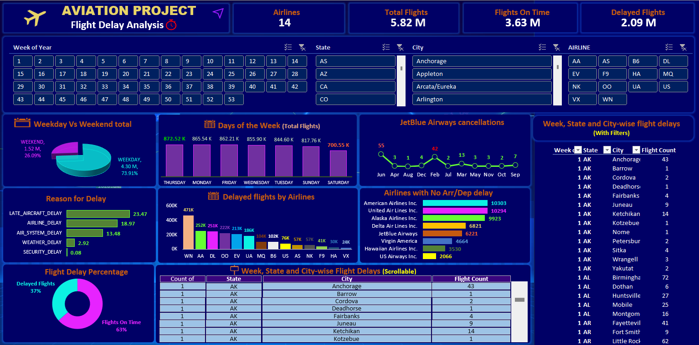
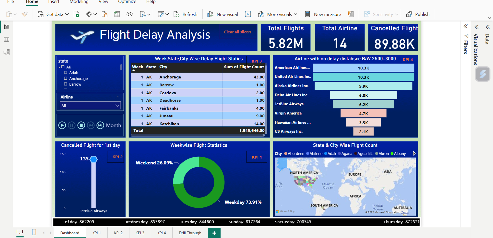

# Aviation Project - Analysis of Flight Delays

The Objective of this project is to gain insight into the reasons for flight delays and associated vectors to help and improve the
overall performance.

Based on the visualizations and dashboards created in Excel, Tableau and PowerBI, we needed to provide our key findings regarding the Key Performance Indicators (KPIs) and provide insights and suggest recommendations.

## Mentors

- Shubham
- Thanuja K M

## Team

- Clive Dominic Andrews
- Shailgiri Jaiswal
- Anusha Veerasamy
- Srushti Kurdikeri
- Vaishnavi Junjarwad
- Rekha Guravvagol
- Prashanth Munde

## Data Set

- Domain : Aviation
- Project Name: Analysis of Flight Delays
- Dataset Name: Total 3 files i.e., airlines.csv (15 records), airport.csv (323 records)  and Flights.csv (5,819,080 records)

## KPIs
1. Weekday Vs Weekend total flights statistics
2. Total number of cancelled flights for JetBlue Airways on first date of every month
3. Week wise, State wise and City wise statistics of delay of flights with airline details
4. Number of airlines with No departure/arrival delay with distance covered between 2500 and 3000

## Observations/Findings

#### KPI 1: Weekday Vs Weekend total flights statistics
- Total count for flights on the Weekday is much higher than Weekend
- Most of the Flights are booked on Thursday i.e., 873K (approx.)
- Least flights are booked on Saturday i.e., 701K (approx.)
- Month-Wise Total Flights is fairly consistent, with highest in July (520K)
- Maximum cancellations on Monday and Tuesday. Major cancellation reason is "B"
- Maximum delay on Monday and Tuesday. Major delay reasons being "Weather" and "Air System" except for Saturday

#### KPI 2: Total number of cancelled flights for JetBlue Airways on first date of every month
- Total number of cancelled flights for JetBlue Airways on first date of every month is 135
- Maximum cancelled flights on first date of every month
- Least cancelled flights on first date of every month
- Major Cancellation Reason for Day-1 is "B"
- Many Airlines have more cancellations that JetBlue
- Delta Airlines has lesser cancellations than JetBlue and is consistent

#### KPI 3: Week wise, State wise and City wise statistics of delay of flights with airline details
- We see that the most delay is seen for South West Airlines with 471k. This is followed by American Airlines with 252.19K, Delta Airlines with 250.84K, Skywest Airlines with 222.44K
- California and Texas are the top States with highest Delayed Flight Count
- Chicago and Atlanta are the top City in Delayed Flight Count

#### KPI 4: Number of Airlines with No departure/arrival delay with distance covered between 2500 and 3000
- There were a total of 53.8K flights with No Departure or Arrival Delays
- The top 3 are American Airlines with 10,303, United Airlines with 10,294 and Alaska Airlines with 9923
- There were a total of 8 Airlines Operating with Distance 2500 - 3000. Top 3 Operators (Market Share) United Air Lines Inc. with 24%, American Airlines with 16.9%, Alaska Airlines with 14.6%

## Key Findings:
- Flight Delay Percentage Chart shows us that the fight Delay is 36% and 62% being on time
- SouthWest Airlines is the Top Most On Time as well as Delayed Flight record
- When we checked for the reason for delay
        - Late Aircraft Delay – 23 minutes (Avg.)
        - Airline Delay – 19 minutes (Avg.)
        - Air System Delay – 13 minutes(Avg.)
        - Weather – 2.92 minutes(Avg.)

## Screenshots

## Excel Dashboard:

## PowerBI Dashboard:

## Tableau Dashboard:

